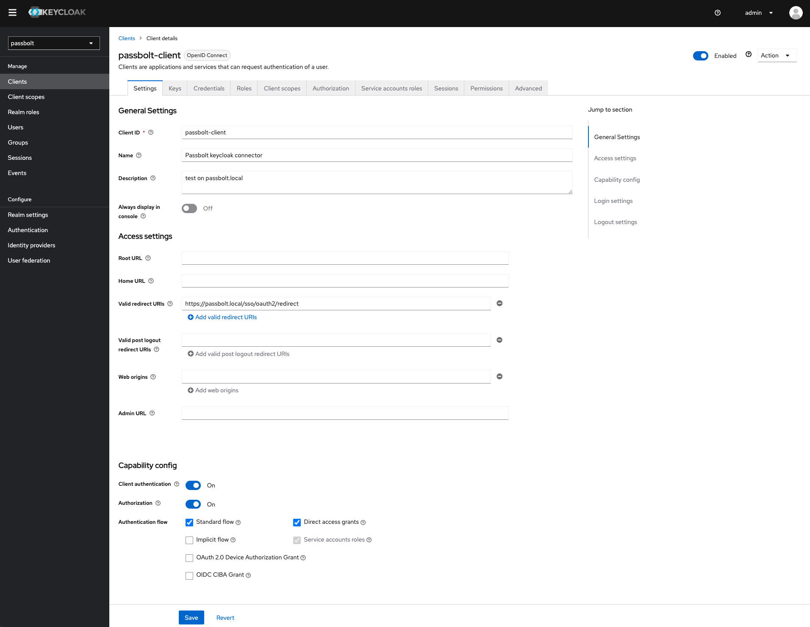
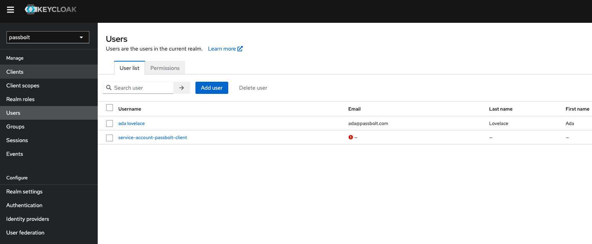
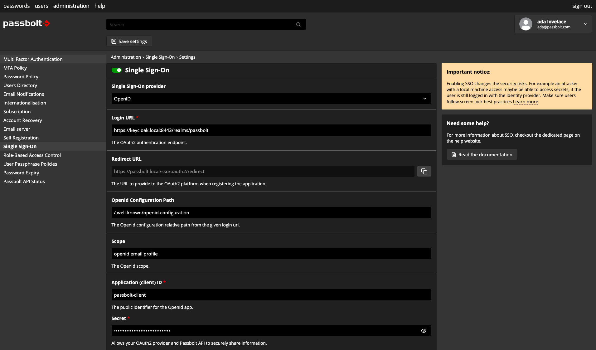
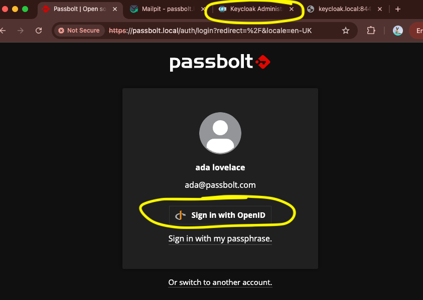

# Passbolt Pro with Keycloak SSO Integration

This repository contains a Docker Compose setup for testing and configuring Keycloak SSO with Passbolt Pro.

## Quick Start

1. Add host entries for `passbolt.local` and `keycloak.local`
2. Add your Passbolt Pro subscription key to a file named `subscription_key.txt` in the project root
3. Run `./scripts/generate-certificates.sh` to create SSL certificates
4. Start the environment with `docker compose up -d`
5. Follow the configuration steps in the [documentation](./DOCUMENTATION.md)

> **Note:** A valid Passbolt Pro subscription key is required for this setup. This key should be placed in a file named `subscription_key.txt` in the project root directory. This file is excluded from version control for security reasons.

## Documentation

For complete setup and configuration instructions, see:

- [Comprehensive Documentation](./DOCUMENTATION.md) - Complete guide with all technical details

## Key Features

- **Passbolt Pro** with OIDC plugin enabled
- **Keycloak 26.3.0** configured for SSO
- **MariaDB** database for both services
- **LDAP** integration (optional)
- **Mailpit** for email testing

## Environment Components

The Docker Compose environment includes:

| Service   | URL                       | Credentials        |
|-----------|---------------------------|-------------------|
| Passbolt  | https://passbolt.local    | Created during setup |
| Keycloak  | https://keycloak.local:8443 | admin / admin    |
| Mailpit   | http://localhost:8025     | N/A               |
| LDAP      | ldap://ldap.local:389     | cn=admin,dc=passbolt,dc=local / P4ssb0lt |

## Repository Structure

```
.
├── assets/                 # Screenshots for documentation
├── config/                 # Configuration files
│   ├── db/                 # Database initialization scripts
│   ├── php/                # PHP configuration files
│   └── ssl/                # SSL configuration templates
├── keys/                   # Certificate storage (generated)
├── ldap-certs/             # LDAP certificates (generated)
├── scripts/                # Utility scripts
│   ├── generate-certificates.sh
│   ├── ldap-entrypoint.sh
│   ├── setup-ldap-certs.sh
│   └── setup-ldap-data.sh
├── docker-compose.yaml     # Docker Compose configuration
├── Dockerfile.passbolt     # Custom Passbolt image definition
├── DOCUMENTATION.md        # Comprehensive documentation
└── README.md               # This file
```

## Screenshots






## Contributing

1. Fork the repository
2. Create your feature branch
3. Commit your changes
4. Push to the branch
5. Create a new Pull Request

## License

This program is free software: you can redistribute it and/or modify it under the terms of the GNU Affero General Public License (AGPL) as published by the Free Software Foundation version 3.

The name "Passbolt" is a registered trademark of Passbolt SA, and Passbolt SA hereby declines to grant a trademark license to "Passbolt" pursuant to the GNU Affero General Public License version 3 Section 7(e), without a separate agreement with Passbolt SA.

This program is distributed in the hope that it will be useful, but WITHOUT ANY WARRANTY; without even the implied warranty of MERCHANTABILITY or FITNESS FOR A PARTICULAR PURPOSE. See GNU Affero General Public License for more details.

You should have received a copy of the GNU Affero General Public License along with this program. If not, see [GNU Affero General Public License v3](https://www.gnu.org/licenses/agpl-3.0.html).
